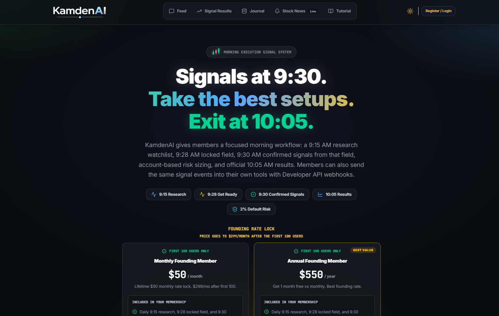
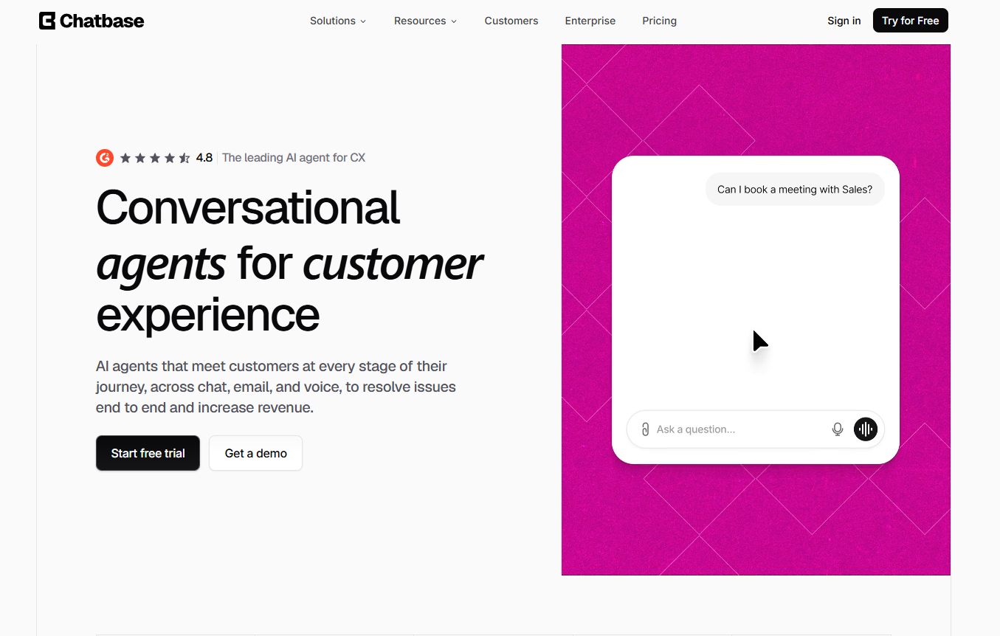

# Awesome AI Tools

### A field-tested AI stack for building, automating, and monetizing ideas.

  
  
  
  

  <a href="#-content--video">Content & Video</a> •
  <a href="#-monetization--e-commerce">Monetization</a> •
  <a href="#-development--websites">Development</a> •
  <a href="#-automation--data">Automation</a> •
  <a href="#-trading--market-intelligence">Markets</a> •
  <a href="#-voice--communication">Voice</a>

> [!NOTE]
> This is not an exhaustive directory. Every tool here earned its place through real use in projects, workflows, or businesses.

> [!IMPORTANT]
> Some links are referral or affiliate links. They may support this project at no extra cost to you, but placement is based on usefulness—not commission.

## ✨ Find your tool

| I want to… | Start with |
|---|---|
| Create and schedule social content | [ViralWave Studio](https://viralwavestudio.com) or [Postiz](https://postiz.com/?ref=chris34) |
| Generate polished AI videos | [HeyGen](https://heygen.com/?sid=rewardful&via=chris-porter) |
| Monetize a custom GPT | [Authflow](https://authflow.ai) |
| Research and sell products online | [EverBee](https://www.everbee.io/?via=christopher-porter) or [Printify](https://try.printify.com/mhf23rn5orq2) |
| Build an app or website with AI | [Lovable](https://lovablelabs.pxf.io/3kzOJd) or [10Web](https://10web.io/?_from=chris35) |
| Automate a workflow | [Make.com](https://www.make.com/en/register?pc=viralwave) |
| Extract or monitor web content | [Apify](https://www.apify.com?fpr=p2hrc6) or [RSS.app](https://rss.app?fpr=chris90) |
| Follow a structured morning market workflow | [KamdenAI](https://kamdenai.com/) |
| Generate realistic AI voice | [ElevenLabs](https://try.elevenlabs.io/n64zmcqt1hc7) |
| Deploy an AI customer-support agent | [Chatbase](https://link.chatbase.co/chris-porter) |
| Automate business communication | [CallHippo](https://callhippo.com?fp_ref=christopher56) |

## 📱 Content & Video

<table>
<tr>
<td width="50%" valign="top">
  <h3 align="center"><a href="https://viralwavestudio.com">ViralWave Studio</a></h3>
  

  
<strong>AI reels · Scheduling · Social publishing</strong>

  
Transforms prompts into social videos and schedules them across your accounts, taking a workflow from idea to publication in one place.

  
<strong>Why it stands out:</strong> It removes the repetitive work behind maintaining a consistent social presence.

  
<a href="https://viralwavestudio.com"><strong>Explore ViralWave Studio →</strong></a>

</td>
<td width="50%" valign="top">
  <h3 align="center"><a href="https://postiz.com/?ref=chris34">Postiz</a></h3>
  

  
<strong>Social management · Design · Cross-posting</strong>

  
An open-source social media suite with an AI content assistant, built-in design tools, analytics, team features, and broad platform support.

  
<strong>Why it stands out:</strong> It combines creation, publishing, automation, and analytics—and can be self-hosted.

  
<a href="https://postiz.com/?ref=chris34"><strong>Explore Postiz →</strong></a>

</td>
</tr>
<tr>
<td width="50%" valign="top">
  <h3 align="center"><a href="https://heygen.com/?sid=rewardful&amp;via=chris-porter">HeyGen</a></h3>
  

  
<strong>AI video · Avatars · Translation</strong>

  
Creates complete videos from text, images, or audio, with voiceovers, multilingual translation, avatars, and brand-aware styles.

  
<strong>Why it stands out:</strong> It makes polished, multilingual video production fast and approachable.

  
<a href="https://heygen.com/?sid=rewardful&amp;via=chris-porter"><strong>Explore HeyGen →</strong></a>

</td>
<td width="50%" valign="top">
  <h3 align="center">Best fit</h3>
  
<strong>Choose by workflow</strong>

  
<strong>ViralWave Studio</strong> for prompt-to-post reel automation.

  
<strong>Postiz</strong> for broad social management and self-hosting.

  
<strong>HeyGen</strong> for presenter-led, translated, or branded AI video.

</td>
</tr>
</table>

<a href="#awesome-ai-tools">Back to top ↑</a>

## 💰 Monetization & E-commerce

<table>
<tr>
<td width="50%" valign="top">
  <h3 align="center"><a href="https://authflow.ai">Authflow</a></h3>
  

  
<strong>GPT paywalls · Access control · Subscriptions</strong>

  
Adds secure paywalls to custom GPTs so creators can package premium AI experiences for paying users.

  
<strong>Why it stands out:</strong> It provides a direct path from useful GPT to paid product.

  
<a href="https://authflow.ai"><strong>Explore Authflow →</strong></a>

</td>
<td width="50%" valign="top">
  <h3 align="center"><a href="https://try.printify.com/mhf23rn5orq2">Printify</a></h3>
  

  
<strong>Print on demand · Fulfillment · Global delivery</strong>

  
Lets creators sell custom products without holding inventory while the platform handles production, fulfillment, and shipping.

  
<strong>Why it stands out:</strong> It turns designs into a scalable product business with minimal operational overhead.

  
<a href="https://try.printify.com/mhf23rn5orq2"><strong>Explore Printify →</strong></a>

</td>
</tr>
<tr>
<td width="50%" valign="top">
  <h3 align="center"><a href="https://www.everbee.io/?via=christopher-porter">EverBee</a></h3>
  

  
<strong>Product research · Etsy SEO · Market validation</strong>

  
Surfaces product, keyword, and marketplace data to help creators validate ideas, spot demand, and improve listings.

  
<strong>Why it stands out:</strong> It replaces guesswork with useful signals before you invest in a product.

  
<a href="https://www.everbee.io/?via=christopher-porter"><strong>Explore EverBee →</strong></a>

</td>
<td width="50%" valign="top">
  <h3 align="center">A practical path</h3>
  
<strong>Research → Create → Monetize</strong>

  
Use <strong>EverBee</strong> to validate demand, <strong>Printify</strong> to fulfill physical products, and <strong>Authflow</strong> to monetize AI-native services.

</td>
</tr>
</table>

<a href="#awesome-ai-tools">Back to top ↑</a>

## 🚀 Development & Websites

<table>
<tr>
<td width="50%" valign="top">
  <h3 align="center"><a href="https://lovablelabs.pxf.io/3kzOJd">Lovable</a></h3>
  

  
<strong>AI app builder · Prototyping · Conversational development</strong>

  
Turns plain-language product ideas into working apps and websites through a chat-based building experience.

  
<strong>Why it stands out:</strong> It dramatically shortens the distance between an idea and a usable prototype.

  
<a href="https://lovablelabs.pxf.io/3kzOJd"><strong>Explore Lovable →</strong></a>

</td>
<td width="50%" valign="top">
  <h3 align="center"><a href="https://10web.io/?_from=chris35">10Web</a></h3>
  

  
<strong>AI websites · Hosting · Optimization</strong>

  
Combines AI-assisted website creation with managed hosting and performance tooling for a streamlined web workflow.

  
<strong>Why it stands out:</strong> It bundles building, hosting, and optimization into one approachable platform.

  
<a href="https://10web.io/?_from=chris35"><strong>Explore 10Web →</strong></a>

</td>
</tr>
</table>

<a href="#awesome-ai-tools">Back to top ↑</a>

## 🔧 Automation & Data

<table>
<tr>
<td width="50%" valign="top">
  <h3 align="center"><a href="https://www.make.com/en/register?pc=viralwave">Make.com</a></h3>
  

  
<strong>Visual automation · App integrations · Workflows</strong>

  
Connects apps and services in a visual workflow builder so repetitive business processes can run automatically.

  
<strong>Why it stands out:</strong> It makes sophisticated multi-step automation accessible without traditional coding.

  
<a href="https://www.make.com/en/register?pc=viralwave"><strong>Explore Make.com →</strong></a>

</td>
<td width="50%" valign="top">
  <h3 align="center"><a href="https://www.apify.com?fpr=p2hrc6">Apify</a></h3>
  

  
<strong>Web scraping · Data extraction · APIs</strong>

  
Provides ready-made scrapers and serverless Actors for collecting structured, real-time data from the web.

  
<strong>Why it stands out:</strong> Its marketplace of existing scrapers can save substantial development time.

  
<a href="https://www.apify.com?fpr=p2hrc6"><strong>Explore Apify →</strong></a>

</td>
</tr>
<tr>
<td width="50%" valign="top">
  <h3 align="center"><a href="https://rss.app?fpr=chris90">RSS.app</a></h3>
  

  
<strong>RSS generation · Monitoring · Content aggregation</strong>

  
Creates feeds from websites and social sources for streamlined monitoring, curation, and distribution.

  
<strong>Why it stands out:</strong> It turns scattered content sources into automation-friendly feeds.

  
<a href="https://rss.app?fpr=chris90"><strong>Explore RSS.app →</strong></a>

</td>
<td width="50%" valign="top">
  <h3 align="center">Build the pipeline</h3>
  
<strong>Collect → Connect → Automate</strong>

  
Use <strong>Apify</strong> for structured web data, <strong>RSS.app</strong> for ongoing content monitoring, and <strong>Make.com</strong> to move that data through your workflow.

</td>
</tr>
</table>

<a href="#awesome-ai-tools">Back to top ↑</a>

## 📈 Trading & Market Intelligence

<table>
<tr>
<td width="50%" valign="top">
  <h3 align="center"><a href="https://kamdenai.com/">KamdenAI</a></h3>
  

  
<strong>Stock signals · Risk sizing · Results tracking</strong>

  
Organizes market-day research into a focused morning sequence: a 9:15 watchlist, 9:28 locked field, 9:30 confirmed signals, and official 10:05 results.

  
<strong>Why it stands out:</strong> It combines entry, stop, target, risk, reward, and position-sizing examples with a results ledger, journal, community, and developer webhooks.

  
<a href="https://kamdenai.com/"><strong>Explore KamdenAI →</strong></a>

</td>
<td width="50%" valign="top">
  <h3 align="center">Know the scope</h3>
  
<strong>Research · Signals · User-controlled execution</strong>

  
KamdenAI is a stock signal and educational-analysis platform, not a broker or auto-trading service. Members remain responsible for deciding whether and how to act on any signal.

  
<strong>Risk note:</strong> Market signals and sizing examples are not financial advice, and trading can result in losses.

</td>
</tr>
</table>

<a href="#awesome-ai-tools">Back to top ↑</a>

## 🎤 Voice & Communication

<table>
<tr>
<td width="50%" valign="top">
  <h3 align="center"><a href="https://try.elevenlabs.io/n64zmcqt1hc7">ElevenLabs</a></h3>
  

  
<strong>Text to speech · Voice generation · Multilingual audio</strong>

  
Generates natural-sounding speech for videos, podcasts, presentations, and AI experiences across multiple languages.

  
<strong>Why it stands out:</strong> It delivers production-quality voiceovers without a traditional recording workflow.

  
<a href="https://try.elevenlabs.io/n64zmcqt1hc7"><strong>Explore ElevenLabs →</strong></a>

</td>
<td width="50%" valign="top">
  <h3 align="center"><a href="https://callhippo.com?fp_ref=christopher56">CallHippo</a></h3>
  

  
<strong>Cloud phone · Omnichannel inbox · AI agents</strong>

  
Brings calls, messages, WhatsApp, analytics, and AI-powered agents into one business communication platform.

  
<strong>Why it stands out:</strong> It automates routine communication while keeping customer interactions organized.

  
<a href="https://callhippo.com?fp_ref=christopher56"><strong>Explore CallHippo →</strong></a>

</td>
</tr>
<tr>
<td width="50%" valign="top">
  <h3 align="center"><a href="https://link.chatbase.co/chris-porter">Chatbase</a></h3>
  

  
<strong>Customer support · AI agents · Omnichannel CX</strong>

  
Builds AI customer-support agents trained on your documents, websites, or databases, then deploys them across web chat, email, messaging, and voice.

  
<strong>Why it stands out:</strong> Its actions, integrations, analytics, lead capture, and human escalation help agents resolve requests instead of only answering questions.

  
<a href="https://link.chatbase.co/chris-porter"><strong>Explore Chatbase →</strong></a>

</td>
<td width="50%" valign="top">
  <h3 align="center">Choose by workflow</h3>
  
<strong>Create · Support · Communicate</strong>

  
<strong>ElevenLabs</strong> for generated voice and audio.

  
<strong>Chatbase</strong> for trainable, omnichannel customer-support agents.

  
<strong>CallHippo</strong> for cloud calling and business communication operations.

</td>
</tr>
</table>

<a href="#awesome-ai-tools">Back to top ↑</a>

## 🧭 How tools earn a spot

This collection favors tools that:

- Solve a real problem in an active workflow
- Save meaningful time or unlock a new revenue path
- Are approachable without a large technical team
- Deliver enough value to recommend from personal experience

Tools are intentionally removed when they no longer fit the collection. Features and pricing change, so always check the linked website before making a purchase decision.

## 🤝 Suggest a tool

Know a tool that belongs here? [Open an issue](https://github.com/cporter202/awesome-ai-tools/issues/new) and share:

- What the tool does
- The workflow it improves
- Why it is better than the obvious alternatives
- Whether you have used it personally

## ☕ Support the project

If this list saves you time, you can help keep it curated and current.

  

Curated by <a href="https://github.com/cporter202">Chris Porter</a> · Repository refreshed August 2026

---

All product names and trademarks belong to their respective owners. This repository is an independent personal curation and is not endorsed by the listed companies.
